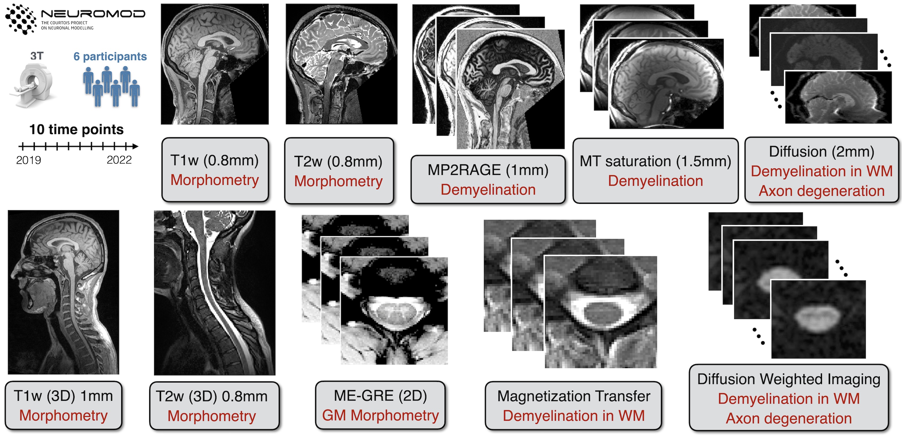

# Longitudinal stability of brain and spinal cord quantitative MRI measures

[Link to interactive preprint](https://courtois-neuromod.github.io/anat-processing-paper/)

We present the initial data release of the Courtois project on neural modeling (CNeuroMod), with a specific focus on the quantitative MRI (qMRI) component. The primary objective of this study was to evaluate the longitudinal stability of qMRI measurements in both the brain and cervical spinal cord. 

To achieve this, we conducted regular scanning sessions over a three-year period involving six participants \autoref{fig:figure1}. Each participant underwent up to ten sessions, providing us with a robust dataset. Our brain qMRI imaging protocols consisted of T1, magnetization transfer (MTR, MTsat), and diffusion techniques. In addition to these, the spinal cord imaging protocol included T1w, T2w, and T2\*w cross-sectional area (CSA) measurements.

The results of our study demonstrate the stability of the qMRI protocols used for both the brain and spinal cord. These findings offer valuable insights for the design of future longitudinal clinical studies in this domain. Furthermore, we have developed reproducible and reusable analysis pipelines for structural qMRI of the brain and spinal cord. These pipelines incorporate cutting-edge tools such as FSL, ANTs, qMRLab, and SCT, ensuring robust and accurate analysis.

To enhance the accessibility and dissemination of our work, we have presented our findings as an interactive article using Jupyter Book and Plotly. This format allows for seamless exploration and sharing of the curated findings within an integrated research object. We believe that this approach will facilitate collaboration and encourage further research in the field of qMRI analysis.

Overall, the initial data release of the Courtois project on neural modeling (CNeuroMod), specifically focusing on the quantitative MRI (qMRI) component, provides a significant contribution to the understanding of the longitudinal stability of qMRI measurements in the brain and spinal cord. The study offers valuable insights for future longitudinal clinical studies and establishes reproducible analysis pipelines for structural qMRI. The interactive article format ensures easy accessibility and encourages collaboration among researchers.

